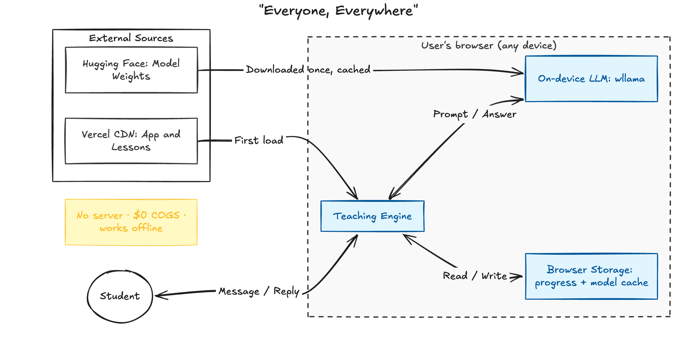

# OpenMaestro

**An open, $0-per-user version of Maestro — an AI tutor that runs *entirely in your browser*.**
No login, no server, no per-lesson cloud bill. The model runs on the learner's own device, so
it's free to scale to the planet and works offline after the first visit.

**Live:** https://openmaestro.vercel.app · North star: *everyone, everywhere, in great quality.*

---

## The idea in one line

The hackathon's hard rule is **$0 COGS** — which forces a **small, on-device model**. Small
models are mediocre tutors *for lack of discipline, not IQ*. So instead of a bigger brain, we
wrap a small one in a **behavioral teaching engine** that handles the exact situations Maestro
slips on (don't leak the answer, don't rubber-stamp wrong work, catch the discouraged student,
be exact with math). Measured in a reproducible in-browser eval: the engine lifts the model
on those scenarios.

## Quick start

```bash
pnpm install
pnpm dev            # http://localhost:3000
```

No API keys, no `.env`, no database — there's nothing to configure. On first visit the browser
downloads the model once (~2 GB, from Hugging Face's CDN) and caches it; after that it loads
from disk and works offline.

```bash
pnpm test           # unit tests (progress, verifier)
pnpm test:e2e       # Playwright: offline + persistence
```

## Architecture



Everything runs in the user's browser — two CDNs seed it once (app + lessons, model weights),
then the teaching engine, the on-device model, and browser storage do the rest. No server,
no database.

## How it's $0 by design

- **Inference on-device** via [wllama](https://github.com/ngxson/wllama) (llama.cpp / WASM),
  CPU — runs on any device, no server.
- **App + lessons + quizzes** are static files on a free CDN.
- **Model weights** come from Hugging Face's CDN, then browser-cached (OPFS, kept via
  `navigator.storage.persist()`) — downloaded once, ever.
- **Progress, streak, chats, profile** live in the browser (`localStorage`). **No backend,
  no database, no accounts** — every new user brings their own compute.
- **Offline** via a service worker; **instant-start** boots a tiny 1B in seconds then
  silently upgrades to the 3B.

## The teaching engine (the differentiator)

- **Always-on discipline** (`lib/tutor/prompt.ts`) — explain/answer by default, withhold only
  when the student should produce the answer; signal shifts; show before you test.
- **Per-turn skills** (`lib/tutor/skills.ts`) — cheap deterministic detection injects one
  focused instruction per moment (distress → empathy, challenge → nudge, submission → don't
  rubber-stamp, math → be exact, …).
- **Verifier** (`lib/tutor/verify.ts`) — a $0 pass over the model's reply that recomputes its
  arithmetic and corrects wrong numbers, and hard-blocks answer-leaks in challenge mode.
- **Mastery gate** — an objective MCQ quiz the tutor opens (no self-marking, unique per
  attempt); the lesson only completes when it's passed.
- **Remembers the student** — name + progress, injected into the prompt from message one.

## How we measure it

`/eval` runs the 20 TutorBench scenarios on-device and scores each with a **deterministic
rubric** (no LLM judge → $0, offline, transparent). **"Prove the engine"** runs the same model
*with and without* the engine and shows the lift, scenario by scenario — measurably better
teaching from the same brain, which is the whole thesis.

## Project structure

```
app/            Next.js App Router pages (tutor + /eval)
components/      UI: onboarding, lesson chat, sidebar, control center, globe, quiz
lib/llm/        engine.ts (wllama adapter) + registry.ts (model tiers)
lib/tutor/      the teaching engine: prompt, skills, verify, progress, quiz, assessor…
lib/eval/       scenarios, deterministic rubric, run harness
data/syllabus/  the three courses (Python, Business, Frontend) as JSON
docs/           DECISIONS · DEMO · PRESENTATION · SCENARIOS
```

## Docs

- **`docs/DECISIONS.md`** — the full design dossier (what/why/how, business model, tradeoffs).
- **`docs/DEMO.md`** — the 3-minute demo script.
- **`docs/PRESENTATION.md`** — the 10-minute talk outline.
- **`docs/SCENARIOS.md`** — paste-able prompts to show the tutor handling TutorBench live.

## Honest limits

It's a **3B running on CPU in a browser** — occasional quirk, and the first visit downloads the
model once. Cross-device sync isn't built (state is per-device by design — private and $0). The
eval rubric is a consistent proxy, not a human grader. The **behavior** — won't cheat, won't
rubber-stamp, catches the math — is the moat, not raw polish.
